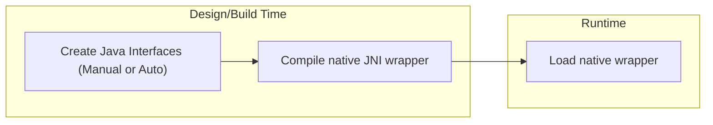

# SVF Java example
Using SVF in Java Projects

## Project aims

Being written in C/C++, SVF is not easily accessible to developers who wish to utilize the native library in other languages (such as Java). This project aims to make it simple for Java developers to start using SVF in their projects as if it were a native JAR. That is, Java developers should be able to use the latest version of SVF without needing to write and maintain a siginificant amount of boilerplate to interact with the native library.

## Quick Start

### Prerequisites
#### Linux
```sh
# Toolchain, Node/NPM, and utils
sudo apt install zlib1g-dev unzip cmake gcc g++ nodejs npm wget curl libncurses5
# JDK
sudo apt install openjdk-17-jdk-headless
```
#### Mac
```sh
# Toolchain
xcode-select --install
# Node/NPM, utils
brew install unzip nodejs npm wget curl
# JDK
brew install openjdk@17
echo 'export PATH="/usr/local/opt/openjdk@17/bin:$PATH"' >> ~/.zshrc
```
### Steps
1. Install SVF Tools using NPM
```sh
npm install -g svf-lib
```
2. Clone this repository
```sh
git clone https://github.com/SVF-Tools/SVF-Java-example
```
3. Produce LLVM IR of `example.c`
```sh
cd SVF-Java-example
clang -S -c -g -fno-discard-value-names -emit-llvm example.c -o example.ll
```
4. Run the gradle project
```sh
./gradlew runDemo --args="example.ll"
```
5. See the `graphs` folder for the generated `icfg.dot`, `vfg.dot`, and `svfg.dot`

## Approaches

There are a few ways to make SVF accessible to Java developers, not limited to:

1. Write a wrapper library to execute an SVF command line program as a process within a Java application 
2. Write a native wrapper and use JNI
3. Use a C++/Java bridge generator such as [javacpp](https://github.com/bytedeco/javacpp). This repo uses this method.

## How it works

Since this project uses JavaCPP to create a C++/Java bridge, this repo cannot be reused to support SVF in other high level languages (C#, TypeScript, Ruby etc.).
More details about the how JavaCPP works can be found at it's [repo](https://github.com/bytedeco/javacpp).

Briefly, the steps involved to enable SVF Java are:
1. Generating native JNI code in C++
    - This repo manually maps a number of high level SVF classes and functions, though it is possible with some work to have JavaCPP generate all the Java interfaces using an [`InfoMap`](https://github.com/bytedeco/javacpp/wiki/Mapping-Recipes)
2. Use the native compiler to output native libraries containing JNI wrappers
3. At runtime, the wrapper library is loaded by JavaCPP, similar to other native libraries



## Adapting this to your project

This example can be easily adapted to many other sorts of Java projects. If you are using gradle, consider the [JavaCPP gradle plugin](https://github.com/bytedeco/gradle-javacpp) properties set in the `build.gradle` file. Many settings for parsing and building the JNI wrapper can be configured there.

### Auto mapping SVF

JavaCPP is capable of mapping Java interfaces for you, given the headers you provide. However, you may need to provide no small amount of assistance in mapping the code when it comes to more complex code. There are a number of examples given at [JavaCPP Presets](https://github.com/bytedeco/javacpp-presets), and further instructions in their [wiki](https://github.com/bytedeco/javacpp/wiki/Mapping-Recipes). However, if you only need a handle of high level API's like this repo demonstrates, consider manually mapping instead.

### Manually mapping classes

This repo demonstrates using manual mapping for a small number of SVF classes to quickly enable usage of SVF from a Java environment. If you are manually mapping, you should:
- Keep the library to a single class
- Use SVF headers to create Java interfaces (ensure you include these headers in the `@Platform` annotation)
- Ensure correct `@Namespace` annotations are set on each implemented class that match the source
- If you don't need to implement a class, consider falling back to `Pointer`
- Where constructor args are required, you may need to implement the appropriate native `allocate(...)` methods which can then be called within the constructor.

### Build system and tips

This project shows using SVF in a gradle based Java project. This is made easy using the JavaCPP gradle plugin, however it is also possible to use other build systems like Maven.

It is recommended that you wrap the native Java interface in another service to ensure correct usage. Consider that you need to ensure thread safety when interacting with native code.

### Change location of dependencies (LLVM, Z3)

The include and link paths for SVF dependencies are defined in the `build.gradle` file. In this case it loads them from the global `node_modules` directory. You can change the `linkPath` and `includePath` to point to different install locations.

### Managing links and includes for platforms

The `SVFLibrary` class shows how the `@Platform` annotation can be used to include specific headers and links. The LLVM links in this example have been informed by using `llvm-config --libs bitwriter core ipo irreader instcombine instrumentation target linker analysis scalaropts support`. The `@Platform` annotation also allows you to configure platforms differently by setting the `value` to target platforms. So you could have separate configuration for `macosx-x86_64`, and another for `linux-x86_64`.

### Adding compiler flags

You can add compiler flags in a few ways:
- Adding directly to the `compilerOptions` property in `build.gradle`
- Add compiler property names to the `@Platform` annotation. Note these are just property names, their values are defined elsewhere. e.g. see the `platform.compiler.*` properties [here for macosx](https://github.com/bytedeco/javacpp/blob/master/src/main/resources/org/bytedeco/javacpp/properties/macosx-x86_64.properties)
- Modifying the `propertyKeysAndValues` map in the `build.gradle` javacpp build task
    - or creating `properties` file in the project resources and setting the `properties` property in the `build.gradle` file to its name.


